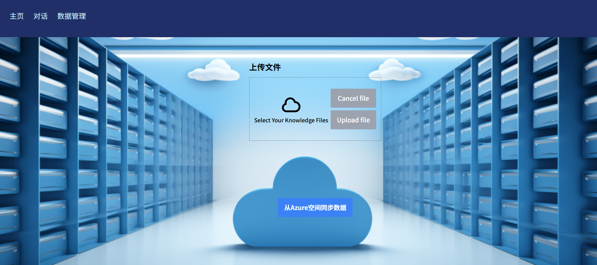
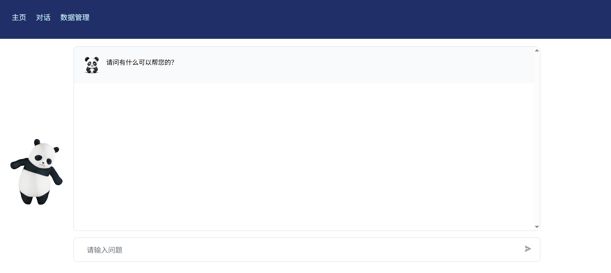

# 智能投顾AI助手 - 基于GPT-4与LangChain的投资咨询平台

基于GPT-4 API构建的智能投资顾问系统，提供专业的投资组合推荐和资产管理咨询服务。

## 📸 系统界面预览

### 主页 - 系统概览

*查看系统介绍和功能导航，提供清晰的入口引导*

### 数据管理页 - Azure云存储

*支持文档上传和Azure云存储数据同步，构建专业投资知识库*

### AI对话页 - 智能投顾助手

*与智能投顾助手实时对话，获取专业的投资建议和组合推荐*

## 🚀 核心功能

### 📊 数据管理
- **文档向量化**: 将投资相关的PDF文档（研究报告、产品介绍等）转换为向量并存储到Pinecone向量数据库
- **知识库构建**: 构建专业的投资知识库，支持多种金融文档格式
- **数据同步**: 支持Azure云存储数据同步，确保知识库实时更新

### 🤖 AI智能对话
- **智能投顾**: 基于构建的知识库回答客户投资咨询问题
- **投资组合推荐**: 根据客户需求推荐合适的投资模型和策略
- **专业咨询**: 提供个性化的资产配置建议和风险评估

### 🎯 技术特色
- **GPT-4驱动**: 采用最新GPT-4模型，提供专业准确的投资建议
- **向量检索**: 基于语义相似性快速检索相关投资信息
- **多模态支持**: 支持文档、图表等多种数据格式处理

## 🛠 技术栈

- **前端**: Next.js, TypeScript, React, Tailwind CSS
- **后端**: LangChain, OpenAI GPT-4 API
- **向量数据库**: Pinecone
- **云存储**: Azure Storage
- **部署**: Vercel/自托管

## 📋 系统要求

请确保您的系统已安装Node.js（版本18或更高）。

## 🚀 快速开始

### 1. 获取项目代码

```bash
git clone [项目地址]
cd gpt4-pdf-chatbot-langchain-myss
```

### 2. 安装依赖

首先安装yarn包管理器（如果还未安装）：

```bash
npm install yarn -g
```

然后安装项目依赖：

```bash
yarn install
```

安装完成后，您将看到 `node_modules` 文件夹。

### 3. 环境配置

创建 `.env` 文件并配置以下变量：

```env
# OpenAI API配置
OPENAI_API_KEY=your_openai_api_key

# Pinecone向量数据库配置
PINECONE_API_KEY=your_pinecone_api_key
PINECONE_ENVIRONMENT=your_pinecone_environment
PINECONE_INDEX_NAME=your_index_name

# Azure存储配置（可选）
AZURE_STORAGE_CONNECTION_STRING=your_azure_connection
```

**获取API密钥：**
- [OpenAI API密钥](https://help.openai.com/en/articles/4936850-where-do-i-find-my-secret-api-key)
- [Pinecone](https://pinecone.io/) - 创建账户并获取API密钥、环境和索引名称

### 4. 系统配置

- 在 `config` 文件夹中，修改 `PINECONE_NAME_SPACE` 为您希望存储向量嵌入的命名空间
- 在 `utils/makechain.ts` 中根据您的用例修改 `QA_PROMPT`
- 确保您有GPT-4 API访问权限（如果使用GPT-4模型）

## 📚 知识库构建

### 方法一：本地文档上传

1. 在项目根目录创建 `docs` 文件夹
2. 将您的PDF投资文档放入该文件夹
3. 运行向量化脚本：

```bash
npm run ingest
```

4. 在Pinecone控制台验证向量数据已成功添加

### 方法二：Web界面管理

1. 启动应用后访问数据管理页面
2. 通过Web界面上传投资相关文档
3. 支持从Azure云存储同步数据
4. 系统自动完成文档向量化处理

## 🖥 运行应用

确认向量数据已成功添加到Pinecone后，启动开发服务器：

```bash
npm run dev
```

访问 `http://localhost:3000` 即可开始使用：

- **主页** ([查看截图](#主页---系统概览)): 查看系统介绍和功能导航
- **AI对话** ([查看截图](#ai对话页---智能投顾助手)): 与智能投顾助手进行投资咨询
- **数据管理** ([查看截图](#数据管理页---azure云存储)): 上传和管理投资知识库文档

## 🔧 故障排除

### 常见问题

**环境相关**
- 确保Node.js版本为18或更高版本：`node -v`
- 检查所有环境变量是否正确配置在 `.env` 文件中
- 确保OpenAI账户有足够的API调用额度
- 验证您有GPT-4 API访问权限

**文档处理问题**
- 尝试使用不同的PDF文件进行测试
- 确保PDF文件不是扫描版本或损坏文件
- 如果是扫描版PDF，需要先进行OCR文字识别转换

**向量数据库问题**
- 确认Pinecone控制台中的环境和索引名称与配置文件匹配
- 检查向量维度设置为 `1536`
- 确保Pinecone命名空间使用小写字母
- 免费计划的索引会在7天不活跃后删除，注意定期访问

**API连接问题**
- 检查网络连接和防火墙设置
- 验证API密钥的有效性
- 确保没有多个OpenAI密钥环境变量冲突

### 重置方案

如果遇到持续问题，可以尝试：
1. 重新创建Pinecone项目和索引
2. 重新克隆项目代码
3. 清除并重新安装依赖包
4. 重新配置环境变量

## 💡 应用场景

本系统特别适用于：

- **财富管理机构**: 为客户提供专业的投资咨询服务
- **投资顾问**: 快速获取投资组合推荐和市场分析
- **金融机构**: 构建内部知识库，提升服务效率
- **个人投资者**: 获得专业的投资建议和风险评估

## 🤝 技术支持

- 前端界面设计灵感来自 [langchain-chat-nextjs](https://github.com/zahidkhawaja/langchain-chat-nextjs)
- 投资模型参考 [摩根大通资产管理](https://am.jpmorgan.com/us/en/asset-management/adv/investment-strategies/model-portfolios/explore-model-portfolios/)

## 📄 许可证

本项目遵循 MIT 许可证。

---

*打造智能投顾新体验，让投资决策更专业、更高效！*
